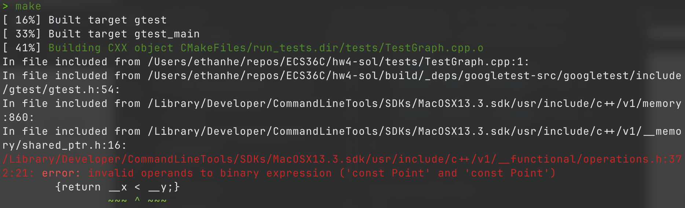

# Discussion 10

---

## Agenda

- Iterator/Iterable
- Comparable
- Trait

---

# Iterator

as long as each object can tell me what is the `next` object

---

## From HW3

```cpp
RandomAccessIter x = first;
for (some loop) {
  if (some condition) {
    x++;
  }
}
```

what is actually "behind" `x++`?

---

## From HW3

```cpp
RandomAccessIter x = first;
for (some loop) {
  if (some condition) {
    x++;
  }
}
```

what is actually "behind" `x++`?

x++ advances the iterator to point to the next element in the collection.

---

### [`std::next`](https://en.cppreference.com/w/cpp/iterator/next)

is defined as

```cpp
template<class InputIt>
InputIt next(
  InputIt it,
  typename std::iterator_traits<InputIt>::difference_type n = 1
);
```

In C++, the std::next function provides a way to advance an iterator.
Definition breakdown:
InputIt it: The iterator to advance.
n: The number of positions to advance (default is 1).

---

### What about `std::distance`?

```cpp
template< class InputIt >
typename std::iterator_traits<InputIt>::difference_type
    distance(InputIt first, InputIt last);
```

std::distance returns the number of increments needed to go from first to last

---

### How to check if the iteration is finished?

i.e. how do we check if we already iterate through all the elements?

---

### How to check if the iteration is finished?

```cpp
template <typename Iter>
bool is_finished(Iter it, Iter end) {
  return it == end;
}

int main() {
  vector<int> xs{1, 2, 3, 4, 5};

  for (auto it = xs.begin();; it++) {
    bool finished = is_finished(it, xs.end());
    std::cout << *it << ": " << std::boolalpha << finished << "\n";
    if (finished) {
      break;
    }
  }

  return 0;
}
```

Function is_finished compares the current iterator it to the end iterator end.

In main(), we iterate over the vector xs and print each element along with whether we've finished iterating.

---

## Improvement?

Why do we need to carry around and compare to `xs.end()` every time?
Is there any way that `next(Iter it)` could tell us when the iteration is finished.

---

### "Improved" `std::next`

```cpp
template<class InputIt>
std::optional<InputIt> next(
  InputIt it,
  typename std::iterator_traits<InputIt>::difference_type n = 1
);
```

By using std::optional, we can represent the possibility of the iterator reaching the end:

If there's a next element, return it wrapped in std::optional.

If not, return std::nullopt, indicating no further elements.

---

## Iterator in other languages are much simpler

---

## Iterator in Rust!

```rs
pub trait Iterator {
    /// The type of the elements being iterated over.
    type Item;

    /// Advances the iterator and returns the next value.
    ///
    /// Returns [`None`] when iteration is finished. Individual iterator
    /// implementations may choose to resume iteration, and so calling `next()`
    /// again may or may not eventually start returning [`Some(Item)`] again at some
    /// point.
    fn next(&mut self) -> Option<Self::Item>;
}
```

---

### Iterator in Python3!

```py
> python3
>>> xs = iter([1, 2, 3])
>>> next(xs)
1
>>> next(xs)
2
>>> next(xs)
3
>>> next(xs)
Traceback (most recent call last):
  File "<stdin>", line 1, in <module>
StopIteration
```

---

## Iterable Type

_Defn_
Any Type `T` is an Iterable Type if it implements `iter()` which return an **iterator** of type `T`.

Then, what is the difference between
a list-like type (`std::vector`, `std::list`, ...) and an iterable type?

---

## Lazy Evaluation

An Iterator implements `next()` of the current iterator,
which can be computed at runtime.

Recall Fibonacci numbers:

$$
\begin{aligned}
& F_0 = 0, F_1 = 1 \\
& F_n = F_{n-1} + F_{n-2}
\end{aligned}
$$

Lazy evaluation is a concept where computations are deferred until their results are needed.

---

### Lazy Fibonacci in Python

```py
class Fibonacci:
    def __init__(self):
        self.cache = [0, 1]
        self.idx = 0

    def __iter__(self):
        return self

    def __next__(self):
        if self.idx < len(self.cache):
            res = self.cache[self.idx]
        else:
            res = self.cache[-1] + self.cache[-2]
            self.cache.append(res)
        self.idx += 1
        return res
```

---

### What if the List type is lazy be default?

---

### Lazy Fibonacci in Haskell

```hs
-- (!!) :: [a] -> Int -> a
-- index operator
fib :: Int -> Int
fib n = fibs' !! n

fibs' :: [Int]
fibs' = 0 : 1 : next fibs
  where
    next (a : t@(b : _)) = (a + b) : next t
```

In Haskell, we can define the Fibonacci sequence as an infinite list.

fibs' is a list starting with 0 and 1, followed by the sum of the previous two numbers.
The next function recursively computes the rest of the sequence.

Using the !! operator, we can access the nth Fibonacci number without computing all previous ones eagerly.

---

### Cont.

when the programmer is lazy

```hs
fibs :: [Int]
fibs = 0 : 1 : zipWith (+) fibs (tail fibs)
```

---

## Other example of Lazy Evaluation?

---

### `take()`

`take()` creates an iterator that contains the first n elements of the current iterator.

```hs
take :: Int -> [a] -> [a]
```

as in Rust

```rs
for i in (0..10).take(5) {
    println!("{}", i);
}
```

---

### `take()` Cont.

taking from infinite list

```hs
ghci> take 3 [5..]
[5,6,7]
```

---

# Ord

Type with order, so they are comparable

---

## Recall From HW2

```cpp
template <typename T>
class TreeSet {
private:
  BinaryTreeNode<T> *_root;
  std::function<int(T, T)> _comparator;
  size_t _size;

public:
  TreeSet(std::function<int(T, T)> comparator);
};
```

why do we need this `_comparator`?

---

## In HW4

```cpp
template <typename T> class Graph {
private:
    std::map<T, std::set<T>> _adjList;

public:
    Graph() = default;
};

```

Is this class definition complete?

---

## `Graph<T>` with self-defined datatype

```cpp
typedef struct {
    float x;
    float y;
} Point;

TEST(GraphTest, TestPointType)
{
    Graph<Point> g;
    g.addVertex({ 1.0, 2.0 });
    g.addVertex({ 3.0, 4.0 });
    g.addEdge({ 1.0, 2.0 }, { 3.0, 4.0 });
    ASSERT_EQ(g.size(), 2);
    ASSERT_TRUE(g.hasEdge({ 1.0, 2.0 }, { 3.0, 4.0 }));
    ASSERT_FALSE(g.hasEdge({ 3.0, 4.0 }, { 1.0, 2.0 }));
}
```

---

## Breaking HW4!



---

For `T a` and `T b`, we need to tell which of them is smaller.

In other words, we require type $T$ to have [total order](https://en.wikipedia.org/wiki/Total_order).
For any ordered $T$, denoted by $Ord\ T$,

$$
\begin{aligned}
<  &: (T, T) \rightarrow Bool \\
== &: (T, T) \rightarrow Bool
\end{aligned}
$$

should be defined.

---

## An Ideal Class Definition for HW2

```cpp
template <typename Ord T>
class TreeSet {
private:
  BinaryTreeNode<T> *_root;
  size_t _size;

public:
  TreeSet();
}
```

where `_comparator` is specified in type `T`.

---

## Modify HW4?

---

# Ad-hoc Polymorphism

polymorphism with limitation on Type Variable


Ad-hoc polymorphism refers to function overloading or operator overloading, where functions can operate on different types based on specific implementations.

---

## "checked" Polymorphism

When developing libraries or products,
we cannot trust the user for using it as excepted.
Therefore, bring the error to us as the developer is necessary.

Newer (some actually older than C++) languages
(Rust, for example) ship this feature with their standard prelude.

---

### Any other than Rust?

Languages like Rust use traits to enforce these constraints, ensuring that types used with certain functions or data structures meet the necessary requirements.

---

## Properties shared by Types

- `class`: defines shared properties between objects / values
- what should we call the shared properties between types?
  - traits (rust, scala, c++, ...)
  - function overloading (c++, java, ...)
  - abstract class (c++, java, ...)
  - typeclass (haskell)
  - modular (ocaml)

---

## Extending Existing Traits

If we already have a trait `Eq` for equivalence relations,
we can say trait `Ord` extends `Eq` with `<`.
In other words, `Ord` "inherits" `==` from `Eq`.

---

## Why Trait?

- "checked" polymorphism
  - template in C++ uses "unchecked" type variables, which is
    - harder to debug
    - harder to analysis
- composition
  - we can require a type to be ordered `Ord` and numeric `Num` at the same time
- automatic deriving functions
  - for `Eq` with `==`, we should also have a `!=`
  - for `Ord` with `<`, we should have `>, >=, <=`, and `max, min`
  - with some function required, other functions can be derived in scope of the trait!
  - in fact, some languages even allow use to derive trait directly

---

## Iterable Tree?

We know a list (vector) is `Iterable`, can we define
[`Iterable` Tree](https://www.seas.upenn.edu/~cis5520/21fa/lectures/stub/02-trees/TreeFolds.html)?

---

## Iterable Tree?

We know a list (vector) is `Iterable`, can we define
[`Iterable` Tree](https://www.seas.upenn.edu/~cis5520/21fa/lectures/stub/02-trees/TreeFolds.html)?

we can indeed define an iterator for a tree by implementing traversal algorithms like in-order, pre-order, or post-order traversal.
Making a tree iterable allows us to use it in contexts where iteration is expected, such as in for loops or functional programming constructs.
This can greatly enhance the flexibility and usability of tree data structures

---
# Additional Materials

- [type_traits in C++](https://en.cppreference.com/w/cpp/header/type_traits)
- [Foldable Typeclass](https://serokell.io/blog/whats-that-typeclass-foldable)
- [Lazy C++](https://livebook.manning.com/book/functional-programming-in-c-plus-plus/chapter-6/50)
- [Implementing Trait in C (ECS153 hw0)](https://github.com/ecs36c-sq2023/ECS153-hw0)