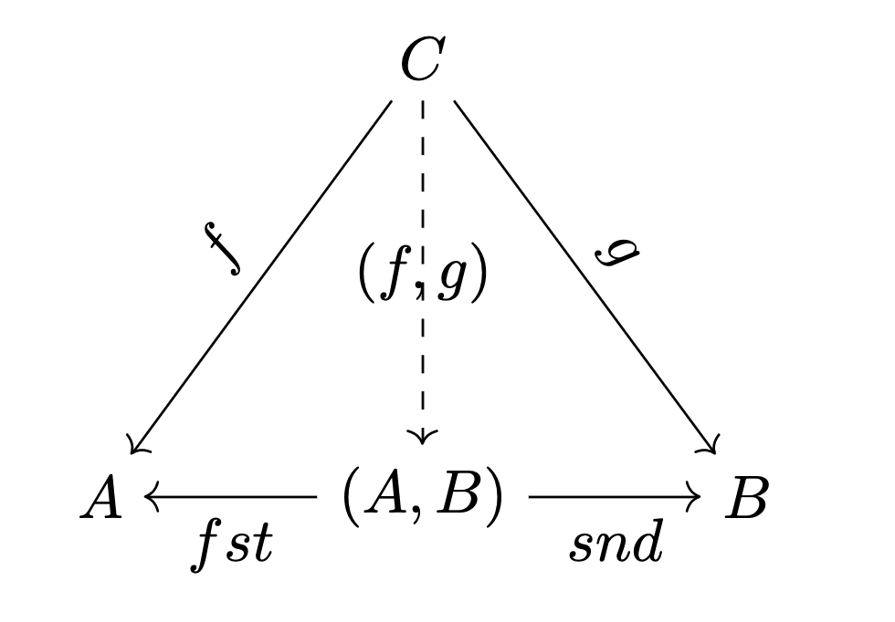
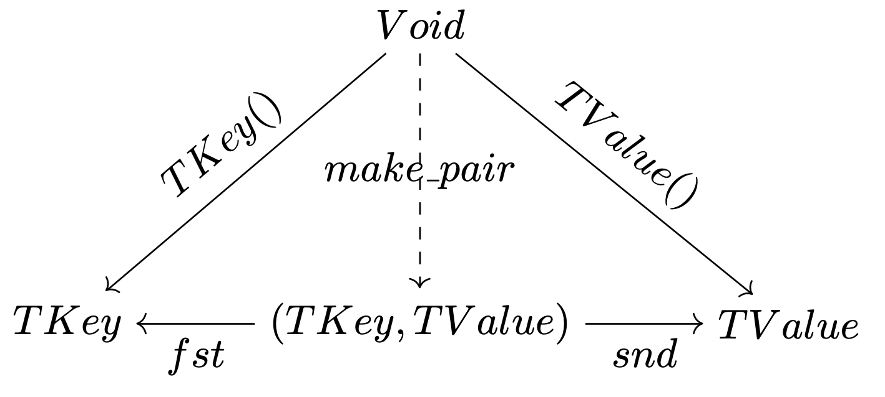

# Discussion 3

## Agenda

- Higher-Order Functions
- Lambda Expressions
- Pair

---

# Higher-Order Functions

a function that taking and/or returning a function

---

## Function pointers

`return_type (*function_pointer_name)(argument_types)`

```cpp
#include <iostream>

int add(int x, int y) {
  return x + y;
}

int operation(int x, int y, int (*func)(int, int)) {
  return func(x, y);
}

int main() {
  int a = 5, b = 3;
  std::cout << "Add: " << operation(a, b, add) << "\n";
  return 0;
}

```

---

## Examples from build-in library

`int atexit(void (*function)(void));`
register a function to be called at normal process termination.

```cpp
#include <stdlib.h>
#include <iostream>

void bye(void){
  std::cout << "That works!\n";
}

int main() {
  atexit(bye);

  std::cout << "Hello World!\n";
  return 0;
}
```

---

## Function Template

`std::function`: a general-purpose polymorphic function wrapper
introduced in `c++11` to replace function pointers.

```cpp
template<class R, class...Args>
class function<R(Args...)>;
```

- `int foo(int)` $\rightarrow$ `std::function<int(int)>`
- `int add(int, int)` $\rightarrow$ `std::function<int(int, int)>`

---

### `std::function` example

```cpp
#include <iostream>
#include <functional>

int multiply(int x, int y) {
  return x * y;
}

int operation(int x, int y, std::function<int(int, int)> func) {
  return func(x, y);
}

int main() {
  int a = 5, b = 3;
  std::function<int(int, int)> mul_f = multiply;
  std::cout << "Multiply: " << operation(a, b, mul_f) << "\n";
  return 0;
}

```

---

### Returning a function

```cpp
std::function<int(int, int)> get_mult() {
  return multiply;
}

int main() {
  int a = 5, b = 3;
  std::function<int(int, int)> mul_f = get_mult();
  std::cout << "Multiply: " << operation(a, b, mul_f) << "\n";
  return 0;
}
```

---

# Lambda Expressions

anonymous, inline functions

---

## (untyped) $\lambda$ Calculus

$\lambda x.x \Rightarrow$ `template <typename T> foo(T x) {return x;}`

$\lambda f. (\lambda x.x) \Rightarrow$ higher-order functions!

<!-- ### what if

$$
\begin{aligned}
  & \lambda f. \lambda x. x \\
  & \lambda f. \lambda x. fx \\
  & \lambda f. \lambda x. f(fx) \\
  & \lambda f. \lambda x. f(f(fx)) \\
  & \dots
\end{aligned} -->
<!-- $$ -->

---

# What's the difference?

$$
\lambda f. \lambda x. x \ \ \text{V.S}\ \  \lambda fx. x
$$

```python
def foo(f):
    def identity(x):
        return x

    return identity

def boo(f, x):
    return x


print(foo(1)(2))
print(boo(1, 2))
```

---

## Lambda expression in C++

common forms

```
[ captures ] ( params ) specs requires (optional) {
  function body
}

// if no parameter
[ captures ] {
  function body
}

```

---

## Capture clause

- `[ ]`: capture nothing in scope
- `[&]`: capture by reference
- `[=]`: capture by value

---

### Capture example

```cpp
int x = 5;

// Capture nothing
auto f0 = [](int y) {
  return x + y;
};

// Capture by value
auto f1 = [=](int y) {
  return x + y;
};

// Capture by reference
auto f2 = [&](int y) {
  x++;
  return x + y;
};

int y = f2(3);
std::cout << "x: " << x << "\n";
std::cout << "y: " << y << "\n";
```

---

<!-- % ### what about this?

% ```cpp
% auto f = [=]() {
%   x++;
%   return x;
% };
% ```

% --- -->

### Generalized capture

creating new variable in capture

```cpp
std::function<int()> sum(std::vector<int> xs) {
  auto f = [ys = std::move(xs)] {
    int sum = 0;
    for (int y : ys) {
      sum += y;
    }
    return sum;
  };
  std::cout << "captured xs len: " << xs.size() << "\n";
  return f;
}

int main() {
  std::vector<int> xs({1, 2, 3, 4, 5});
  auto f = sum(xs);

  std::cout << "Sum: " << f() << "\n";
  std::cout << "xs len: " << xs.size() << "\n";

  return 0;
}
```

<!-- ---

## Higher-order functions with lambda

```cpp
template <typename T> struct Sorter {
  std::function<bool(T, T)> cmp;

  Sorter(std::function<bool(T, T)> cmp) : cmp(cmp) {}

  void sort(std::vector<T> &v) {
    std::sort(v.begin(), v.end(), cmp);
  }
};

int main() {
  std::vector<int> xs{1, 3, 2, 7, 5, 10};
  Sorter<int> sorter([](int x, int y) { return x < y; });
  sorter.sort(xs);
  for (int x : xs) {
    std::cout << x << "\n";
  }
  return 0;
}
``` -->

---

# Pair

two heterogeneous objects as a single unit

a tuple with only 2 elements

---

## Defining A Pair

Let $A, B, C$ be types, then $(A, B)$ is a pair of type $A$ **and** $B$.



$(A, B)$ is just another notation for $A \times B$,
which is the [Cartesian product](https://en.wikipedia.org/wiki/Cartesian_product) of set $A$ and $B$.
So this type is also called a **product type**.

---


---



---

Suppose we have a comparison function

$$
isDefault: A \rightarrow Bool
$$

what checks if a given value $a \in A$ is a default value of type $A$.

How should we get

$$
isDefault_{pair}: (TKey, TValue) \rightarrow Bool
$$

---

recall

$$
fst: (A, B) \rightarrow A
$$

so

$$
\begin{aligned}
& isDefault_{pair}: (TKey, TValue) \rightarrow Bool \\
& isDefault_{pair} = isDefault \circ fst
\end{aligned}
$$

---

### Pair in C++

```cpp
template<class _T1, class _T2>
struct pair {
  _T1 first;                 // first is a copy of the first object
  _T2 second;                // second is a copy of the second object

  pair() : first(), second() { }
  pair(const _T1& __a, const _T2& __b) : first(__a), second(__b) { }

  inline pair<_T1, _T2> make_pair(_T1 __x, _T2 __y){
    return pair<_T1, _T2>(__x, __y);
  }
}

```

---

## Comparing the key in C++

```cpp
bool cmp(int a, int b) { return a < b; }

template <typename T>
bool cmp_pair(std::pair<int, T> a, std::pair<int, T> b) {
  return a.first < b.first;
}

int main() {
  std::pair<int, std::string> p1(1, "hello");
  std::pair<int, std::string> p2(2, "world");
  std::cout << cmp_pair(p1, p2) << std::endl;
  return 0;
}
```
