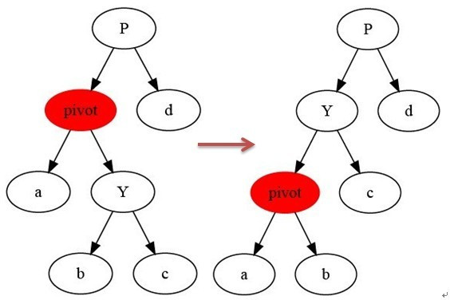
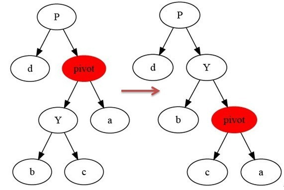
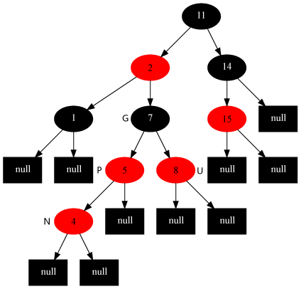
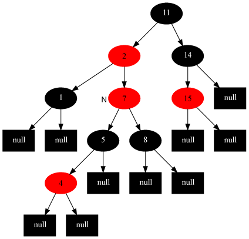

# Discussion 5

Jeremy Wang

---

## Agenda

- Tree Traversal
- Red Black Trees

---

## What is Tree Traversal?

- **Tree traversal** is the process of visiting each node in a tree data structure exactly once in a systematic way.
- Different traversal methods are used for different purposes.

---

## Tree Traversal

- Pre-order
- In-order
- Post-order

---


## Tree Traversal


---


## Tree Traversal


Pre-order: 1, 7, 2, 6, 5, 11, 9, 9, 5

In-order: 2, 7, 5, 6, 11, 1, 9, 5, 9

Post-order: 2, 5, 11, 6, 7, 5, 9, 9, 1

---

## Tree Traversal

Which traversal should we use if we want to delete all nodes in the tree?

---

## What is a Binary Search Tree (BST)?

- A **Binary Search Tree (BST)** is a type of binary tree where each node has a key (and associated value) and satisfies the following properties:

  - The key of the **left** subtree is **less than** the key of its parent node.
  - The key of the **right** subtree is **greater than** the key of its parent node.
  - Both the left and right subtrees must also be binary search trees.

- **Properties of BST:**

  - Enables efficient searching, insertion, and deletion operations.
  - The in-order traversal of a BST results in a sorted sequence of the keys.

---


## Tree Traversal


Is this a binary search tree?

---


## Tree Traversal


For a binary search tree, in-order traversal gives you a sorted sequence.

---

## Red Black Tree

---

### Properties

- Why Red Black Tree?

- What are the properties of a Red Black Tree?


---

# What is a Red-Black Tree?
- A Red-Black Tree is a type of self-balancing BST.
Ensures the tree remains approximately balanced after insertions and deletions.

---

# Why Red-Black Trees?
- Guarantees that the longest path is no more than twice the shortest path.
Operations like search, insert, and delete take O(log n) time in the worst case.

---
### Properties

1. Each node is either red or black
2. Root is black
3. Each Leaf is black
4. Each red node has only black children
5. For each node, all simple paths from the node to descendent leaves contain
   the same number of black nodes.

---

### Rotations

- Left Rotation
- Right Rotation
---

## Left Rotation

- **Purpose**: To rebalance the tree when the right child of a node causes imbalance.

---

### Left Rotations

- **How it works**:
  - Pivot around the link between a node `x` and its right child `y`.
  - `y` becomes the new parent of `x`.
  - The left subtree of `y` becomes the right subtree of `x`.



---

## Left Rotation Explanation

- **Assumptions**:
  - Node `x` is a non-leaf node in the tree.
  - The right child `y` of `x` is not `NIL[T]`.
- **Process**:
  1. The left rotation makes `y` the new root of the subtree.
  2. The left child `b` of `y` becomes the right child of `x`.
  3. The parent of `x` becomes the parent of `y`.
  4. Update the parent pointers accordingly.

---

## Left Rotation Pseudocode

```plaintext
LEFT-ROTATE(T, x)
1  y ← right[x]            ▹ Set y.
2  right[x] ← left[y]       ▹ Turn y's left subtree into x's right subtree.
3  if left[y] ≠ NIL[T]
4      then p[left[y]] ← x
5  p[y] ← p[x]              ▹ Link x's parent to y.
6  if p[x] = NIL[T]
7      then root[T] ← y
8      else if x = left[p[x]]
9              then left[p[x]] ← y
10             else right[p[x]] ← y
11 left[y] ← x              ▹ Put x on y's left.
12 p[x] ← y
```
---
### Right Rotations


---
### Insertion

1. Insert as regular binary search tree.
2. Set new node's color to Red. (Why?)
3. Fix up. (Which rule could be violated?)

---

### BST Insertion
```
RB-INSERT(T, z)
1  y ← NIL[T]
2  x ← root[T]
3  while x ≠ NIL[T]
4      do y ← x
5         if key[z] < key[x]
6            then x ← left[x]
7            else x ← right[x]
8  p[z] ← y
9  if y = NIL[T]
10     then root[T] ← z
11     else if key[z] < key[y]
12             then left[y] ← z
13             else right[y] ← z
14 left[z] ← NIL[T]
15 right[z] ← NIL[T]
16 color[z] ← RED
17 RB-INSERT-FIXUP(T, z)
```

---


### Why Set the New Node's Color to Red?

- **After inserting the new node as in a regular BST**, we set its color to **red**.

- **Reason**:

  - **Maintaining Property 5**:

    - Setting the new node as red **does not increase the black height** of any paths.
    - This helps to maintain **Property 5**: For each node, all paths from the node to its descendant leaves contain the same number of black nodes.

  - **Avoiding Violation of Property 5**:

    - If we set the new node as black, it would increase the black height of paths passing through it, potentially violating Property 5.

---
- **Possible Violation**:

  - **Property 2**: If the new node is the root and we set it red, we violate the rule that the root must be black.
  - **Property 4**: If the parent is also red, setting the new node red violates the rule that red nodes cannot have red children.

- **Next Step**:

  - **We fix any violations in step 3** using rotations and recoloring.

---

### Insertion Fix up

3 pairs of cases:

1. Parent and Uncle Red
2. Parent Red, Uncle Black, Left Child
3. Parent Red, Uncle Black, Right Child

---
### We use the RB-INSERT-FIXUP procedure to restore the Red-Black properties.
```
RB-INSERT-FIXUP（T,z）
 1 while color[p[z]] = RED  
 2     do if p[z] = left[p[p[z]]]  
 3           then y ← right[p[p[z]]]  
 4                if color[y] = RED  
 5                   then color[p[z]] ← BLACK                    ▹ Case 1  
 6                        color[y] ← BLACK                       ▹ Case 1  
 7                        color[p[p[z]]] ← RED                   ▹ Case 1  
 8                        z ← p[p[z]]                            ▹ Case 1  
 9                   else if z = right[p[z]]  
10                           then z ← p[z]                       ▹ Case 2  
11                                LEFT-ROTATE(T, z)              ▹ Case 2  
12                           color[p[z]] ← BLACK                 ▹ Case 3  
13                           color[p[p[z]]] ← RED                ▹ Case 3  
14                           RIGHT-ROTATE(T, p[p[z]])            ▹ Case 3  
15           else (same as then clause  
                         with "right" and "left" exchanged)  
16 color[root[T]] ← BLACK  
```
---
### Insertion Fix-up Case 1
**Situation**:

    - The parent of z is red.
    - The uncle y of z is red.
    - Both the parent and uncle are red.
**Actions**:

    - Recolor the parent and uncle to black.
    - Recolor the grandparent to red.
    - Move z up to the grandparent.
    - Repeat the process starting from the new z.

**Code**:
```
5   color[p[z]] ← BLACK
6   color[y] ← BLACK
7   color[p[p[z]]] ← RED
8   z ← p[p[z]]
```
---


## Insertion Fix-up Case 1

| Before Fix-up                                           | After Fix-up                                            |
|---------------------------------------------------------|---------------------------------------------------------|
|  |  |

---

### Insertion Fix-up Case 2
**Situation**:

    - The parent of z is red.
    - The uncle y of z is black.
    - z is the right child of its parent.
**Actions**:

    - Set z to its parent p[z].
    - Left Rotate at p[z].
    - This transforms the situation into Case 3.

**Code**:
```
9   else if z = right[p[z]]
10  then z ← p[z] 
11  LEFT-ROTATE(T, z)
```

---

## Insertion Fix-up Case 2

| Before Fix-up                                           | After Fix-up                                            |
|---------------------------------------------------------|---------------------------------------------------------|
|  |  |

---

### Insertion Fix-up Case 3

**Situation**:

- The parent of `z` is **red**.
- The uncle `y` is **black**.
- `z` is the **left child** of its parent.

**Actions**:

- Recolor the parent `p[z]` to **black**.
- Recolor the grandparent `p[p[z]]` to **red**.
- **Right Rotate** at the grandparent `p[p[z]]`.

**Code**:

```
12       color[p[z]] ← BLACK
13       color[p[p[z]]] ← RED
14       RIGHT-ROTATE(T, p[p[z]])
```
---

## Insertion Fix-up Case 3

| Before Fix-up                                           | After Fix-up                                            |
|---------------------------------------------------------|---------------------------------------------------------|
|  |  |

---
Thank you!