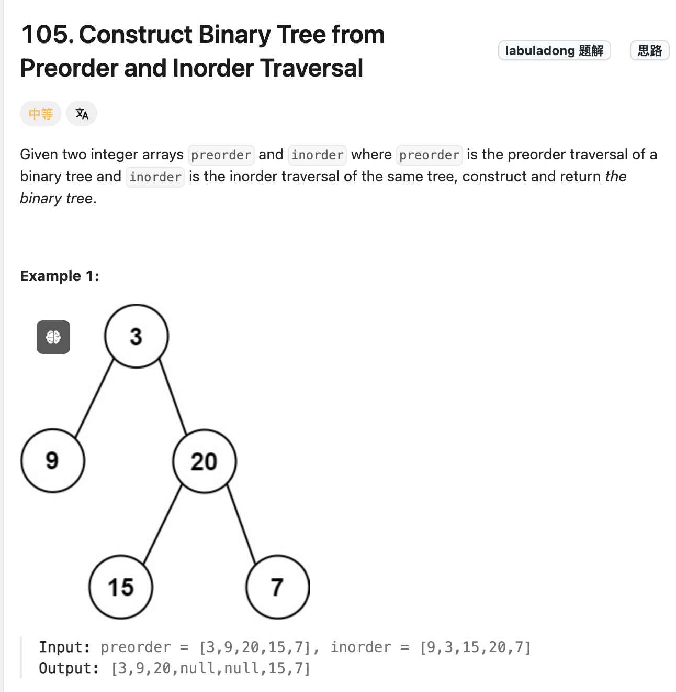
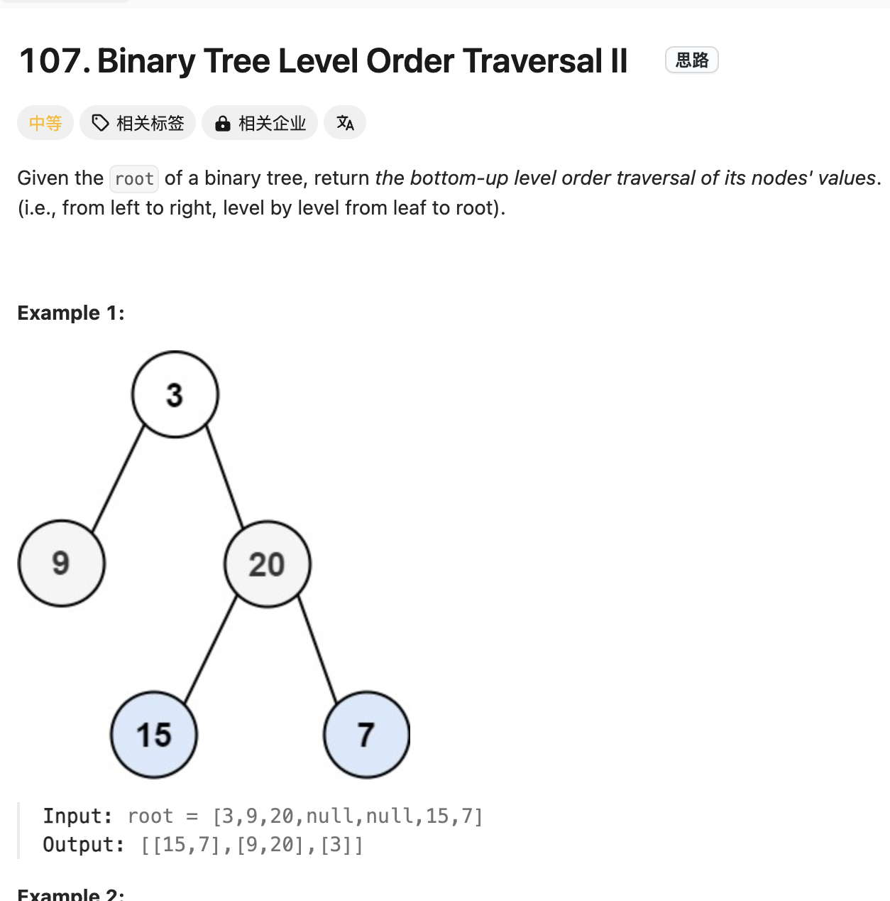

# Discussion 6

Jeremy Wang

---

## Agenda

- Knowledge Review
    1. **Asymptotic Notation**
    2. **Stacks, Queues, Linked Lists**
    3. **Hash Tables**
    4. **Binary Search Trees (BST)**
    5. **Red-Black Trees**

---

# 1. Asymptotic Notation

---

## Big O Notation

- **Definition**: Describes the upper bound of an algorithm's running time.
- **Purpose**: To classify algorithms according to their growth rates.
- **Common Big O Notations**:
  - **O(1)**: Constant time
  - **O(log n)**: Logarithmic time
  - **O(n)**: Linear time
  - **O(n log n)**: Linearithmic time
  - **O(n^2)**: Quadratic time

---

## Big Ω and Big Θ Notation

- **Big Ω (Omega) Notation**:
  - Represents the lower bound of an algorithm's running time.
- **Big Θ (Theta) Notation**:
  - Represents the exact bound of an algorithm's running time.
- **Usage**:
  - **Big O**: Worst-case scenario
  - **Big Ω**: Best-case scenario
  - **Big Θ**: Average-case scenario (tight bound)

---

## Comparing Functions

- **Hierarchy of Growth Rates**:
  - **Constant < Logarithmic < Linear < Linearithmic < Quadratic < Cubic < Exponential**
- **Example**:
  - **O(log n) < O(n) < O(n log n) < O(n^2)**

---

# 2. Stacks, Queues, Linked Lists

---

## Stacks

- **Definition**: Linear data structure following LIFO (Last-In, First-Out) principle.
- **Operations**:
  - **push(element)**: Insert element at the top.
  - **pop()**: Remove and return the top element.
  - **peek()**: Return the top element without removing it.
- **Applications**:
  - Expression evaluation
  - Backtracking algorithms
  - Function call management in recursion

---

## Queues

- **Definition**: Linear data structure following FIFO (First-In, First-Out) principle.
- **Operations**:
  - **enqueue(element)**: Insert element at the rear.
  - **dequeue()**: Remove and return the front element.
  - **front()**: Return the front element without removing it.
- **Applications**:
  - Scheduling algorithms
  - Breadth-first search (BFS)
  - Buffer management

---

## Linked Lists

- **Definition**: A linear collection of nodes, where each node contains data and a reference to the next node.
- **Types**:
  - **Singly Linked List**: Nodes have a single reference to the next node.
  - **Doubly Linked List**: Nodes have references to both the next and previous nodes.
- **Operations**:
  - **Insertion**: At beginning, end, or any position.
  - **Deletion**: Remove a node from the list.
  - **Traversal**: Access each node sequentially.

---

## Linked List vs. Arrays

| **Aspect**      | **Linked List**         | **Array**                |
|-----------------|-------------------------|--------------------------|
| Memory Allocation | Dynamic                | Static (fixed size)      |
| Insertion/Deletion | O(1) at head (singly) | O(n) due to shifting     |
| Random Access   | Not efficient (O(n))    | Efficient (O(1))         |
| Memory Overhead | Extra memory for pointers | No extra memory          |

---

# 3. Hash Tables

---

## What is a Hash Table?

- **Definition**: Data structure that maps keys to values using a hash function.
- **Hash Function**: Converts a key into an index in the array.
- **Goal**: Achieve constant time complexity O(1) for search, insert, and delete operations.

---

## Collision Resolution Techniques

1. **Chaining**:
   - Each array index contains a linked list of entries.
   - Colliding elements are stored in the list at that index.

2. **Open Addressing**:
   - Probes for the next available slot according to a probing sequence.
   - Types:
     - **Linear Probing**: 
        $$
        h(k, i) = (h(k) + i) \mod m
        $$
     - **Quadratic Probing**: 
        $$
        h(k, i) = (h(k) + c_1 i + c_2 i^2) \mod m
        $$
     - **Double Hashing**: 
        $$
        h(k, i) = (h_1(k) + i \cdot h_2(k)) \mod m
        $$

---

## Load Factor and Performance

- **Load Factor (α)**: 
    $$
    \alpha = \frac{n}{m}
    $$
  - \( n \): Number of elements
  - \( m \): Size of the hash table
- **Impact on Performance**:
  - **Chaining**:
    - Expected search time: O(1 + α)
  - **Open Addressing**:
    - Expected search time depends on α; as α approaches 1, performance degrades.

---

## Hash Functions

- **Good Hash Function Properties**:
  - **Deterministic**: Same key produces same hash.
  - **Uniformity**: Distributes keys uniformly across the table.
  - **Efficiency**: Quick to compute.

- **Common Hash Functions**:
  - **Division Method**: 
    $$ 
    h(k) = k\mod m 
    $$
  - **Multiplication Method**: 
    $$ 
    h(k) = \lfloor m (kA\mod 1) \rfloor
    $$
    - \( A \) is a constant between 0 and 1.

---

# 4. Binary Search Trees (BST)

---

## What is a BST?

- **Definition**: A binary tree where each node has:
  - A key greater than all keys in its left subtree.
  - A key less than all keys in its right subtree.
- **Operations**:
  - **Search**
  - **Insert**
  - **Delete**
  - **Traversal**

---

## BST Operations

### Search

- **Algorithm**:
  - Start at the root.
  - If key equals node's key, return node.
  - If key < node's key, search left subtree.
  - If key > node's key, search right subtree.
- **Time Complexity**: O(h), where h is the height of the tree.

---

### Insertion

- **Algorithm**:
  - Similar to search to find the correct spot.
  - Insert the new node as a leaf.
- **Time Complexity**: O(h)

---

### Deletion

- **Cases**:
  1. **Node is a leaf**:
     - Remove it.
  2. **Node has one child**:
     - Replace node with its child.
  3. **Node has two children**:
     - Find the in-order successor (smallest in right subtree) or predecessor (largest in left subtree).
     - Replace node's key with successor/predecessor key.
     - Delete successor/predecessor node.
- **Time Complexity**: O(h)

---

## Tree Traversals

- **In-order Traversal**:
  - Left subtree → Node → Right subtree
  - **Result**: Nodes are visited in ascending order.
- **Pre-order Traversal**:
  - Node → Left subtree → Right subtree
- **Post-order Traversal**:
  - Left subtree → Right subtree → Node
- **Level-order Traversal**:
  - Visit nodes level by level.

---

## BST Properties

- **Balanced vs. Unbalanced Trees**:
  - **Balanced**: h = O(log n)
  - **Unbalanced**: h can be O(n)
- **Importance of Balance**:
  - Ensures operations remain efficient.
  - Unbalanced trees degrade to linked lists.

---

https://leetcode.com/problems/construct-binary-tree-from-preorder-and-inorder-traversal/description/

---

https://leetcode.com/problems/binary-tree-level-order-traversal-ii/description/

---

# 5. Red-Black Trees

---

## What is a Red-Black Tree?

- **Definition**: A self-balancing binary search tree with extra properties to ensure balance.
- **Properties**:
  1. Every node is either **red** or **black**.
  2. The root is **black**.
  3. All leaves (NIL nodes) are **black**.
  4. Red nodes cannot have red children (no two reds in a row).
  5. Every path from a node to its descendant NIL nodes has the same number of black nodes.

---

## Operations and Time Complexity

- **Search, Insert, Delete**: O(log n)
- **Balancing**:
  - Performed during insertions and deletions.
  - Uses rotations and recoloring to maintain properties.

---

## Insertion in Red-Black Trees

1. **Insert** as in a regular BST.
2. **Color** the new node **red**.
3. **Fix-up**:
   - If the parent is black, done.
   - Else, perform rotations and recoloring to fix violations.

---

## Insertion Fix-up Cases

### Case 1

- **Situation**: Parent and uncle are red.
- **Action**:
  - Recolor parent and uncle to black.
  - Recolor grandparent to red.
  - Move up to grandparent.

---

### Case 2

- **Situation**: Parent is red, uncle is black, node is right child.
- **Action**:
  - Rotate left at parent.
  - Convert to Case 3.

---

### Case 3

- **Situation**: Parent is red, uncle is black, node is left child.
- **Action**:
  - Recolor parent to black and grandparent to red.
  - Rotate right at grandparent.

---

## Rotations

- **Left Rotation**:
  - Pivot around the link between a node and its right child.
- **Right Rotation**:
  - Pivot around the link between a node and its left child.
- **Purpose**:
  - Adjust the structure to maintain balance.

---

## Deletion in Red-Black Trees

1. **Delete** node as in a regular BST.
2. **Fix-up**:
   - If the deleted node was red, done.
   - Else, perform fix-up to restore properties.

---

## Deletion Fix-up Cases

- **Cases involve**:
  - Sibling's color.
  - Sibling's children colors.
  - Rotations and recoloring are used.

---

## Why Red-Black Trees?

- **Balanced Tree Guarantees**:
  - Ensures that the tree height is O(log n).
- **Performance**:
  - Provides worst-case time complexity guarantees.
- **Applications**:
  - Used in implementations of associative arrays.
  - Example: `std::map` in C++.

---

# Good Luck!

