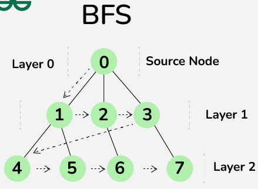
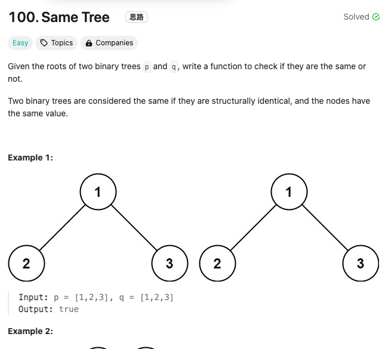
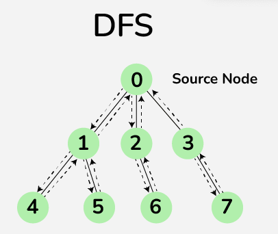
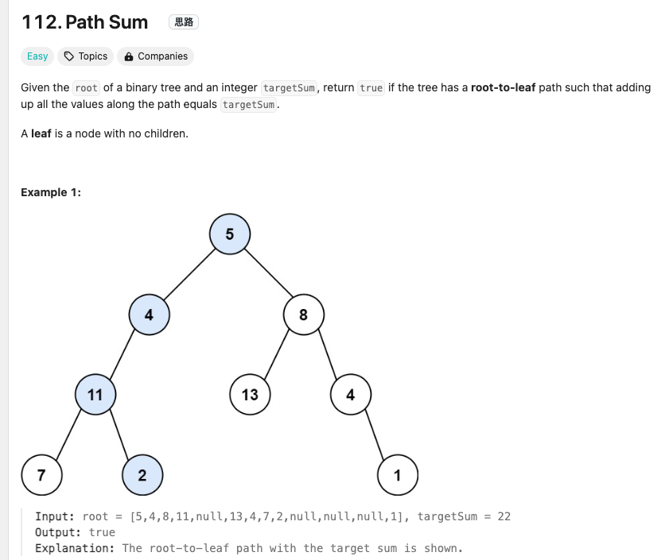

# Discussion 9

---

## Agenda

- Introduction to Graph Traversal
- Breadth-First Search (BFS)
  - Algorithm Explanation
  - BFS Implementation
  - BFS Applications
- Depth-First Search (DFS)
  - Algorithm Explanation
  - DFS Implementation
  - DFS Applications
- Comparison between BFS and DFS

---

## Introduction to Graph Traversal

- **Graph Traversal**: Visiting all the nodes (vertices) of a graph in a systematic manner.
- **Why Traversal?**
  - Searching for specific nodes or paths.
  - Checking connectivity.
  - Finding shortest paths.
  - Solving puzzles and games.

---

## Types of Graph Traversal

- **Breadth-First Search (BFS)**
  - Explores neighbor nodes level by level.
- **Depth-First Search (DFS)**
  - Explores as far as possible along each branch before backtracking.

---

## Breadth-First Search (BFS)

### Overview

- BFS is a **level-order** traversal.
- Uses a **queue** to keep track of nodes to visit.
- Ideal for finding the shortest path in an unweighted graph.

---

## BFS Algorithm Steps

1. **Initialize**
   - Create a queue and enqueue the starting node.
   - Mark the starting node as visited.
2. **Loop**
   - While the queue is not empty:
     - Dequeue a node `u` from the queue.
     - For each unvisited neighbor `v` of `u`:
       - Mark `v` as visited.
       - Enqueue `v` into the queue.

---

## BFS Implementation

```cpp
#include <iostream>
#include <vector>
#include <queue>

void BFS(int start, const std::vector<std::vector<int>>& adjList, std::vector<bool>& visited) {
    std::queue<int> q;
    visited[start] = true;
    q.push(start);

    while (!q.empty()) {
        int u = q.front();
        q.pop();
        std::cout << u << " ";

        for (int v : adjList[u]) {
            if (!visited[v]) {
                visited[v] = true;
                q.push(v);
            }
        }
    }
}
```
---

## BFS Example

Given the following graph:



---

## BFS Example

Given the following graph:


- Starting from node `0`, the BFS traversal order is:
  - `0 -> 1 -> 2 -> 3 -> 4 -> 5 -> 6 ->`

---
## BFS Example



https://leetcode.com/problems/same-tree/

---
## BFS Applications

- **Shortest Path in Unweighted Graphs**
  - Finds the shortest path between nodes.
- **Web Crawlers**
  - Used to traverse web pages.
- **Social Networking**
  - Finding people within a certain degree of connection.

---

## Depth-First Search (DFS)

### Overview

- DFS is a **preorder** traversal.
- Uses a **stack** (often via recursion) to keep track of nodes.
- Explores as deep as possible before backtracking.

---

## DFS Algorithm Steps

1. **Recursive Function**
   - Mark the current node `u` as visited.
   - For each unvisited neighbor `v` of `u`:
     - Recursively call DFS on `v`.

---

## DFS Implementation

```cpp
#include <iostream>
#include <vector>

void DFS(int u, const std::vector<std::vector<int>>& adjList, std::vector<bool>& visited) {
    visited[u] = true;
    std::cout << u << " ";

    for (int v : adjList[u]) {
        if (!visited[v]) {
            DFS(v, adjList, visited);
        }
    }
}
```
---
## DFS Example

Given the same graph:



---
## DFS Example

Given the same graph:


- Starting from node `0`, one possible DFS traversal order is:
  - `0 -> 1 -> 4 -> 5 -> 2 -> 6 -> 3 ->7`

---
## DFS Example
https://leetcode.com/problems/path-sum/description/?envType=problem-list-v2&envId=depth-first-search




---

## DFS Applications

- **Topological Sorting**
  - Ordering of nodes in a directed acyclic graph.
- **Cycle Detection**
  - Finding cycles in graphs.
- **Puzzle Solving**
  - Such as mazes and Sudoku.

---

## Comparison between BFS and DFS

|            | BFS                         | DFS                        |
|------------|-----------------------------|----------------------------|
| Data Structure | Queue                    | Stack (recursion)          |
| Approach       | Level-order traversal    | Depth-wise traversal       |
| Uses           | Shortest path in unweighted graphs | Topological sorting, cycle detection |
| Memory Usage   | Can be high (stores all nodes at a level) | Generally lower (path nodes only) |

---

## Key Takeaways

- **BFS** is ideal for shortest path and level-order traversal.
- **DFS** is useful for exploring all possibilities and backtracking.
- Choice depends on the specific problem requirements.

---

Thank you!