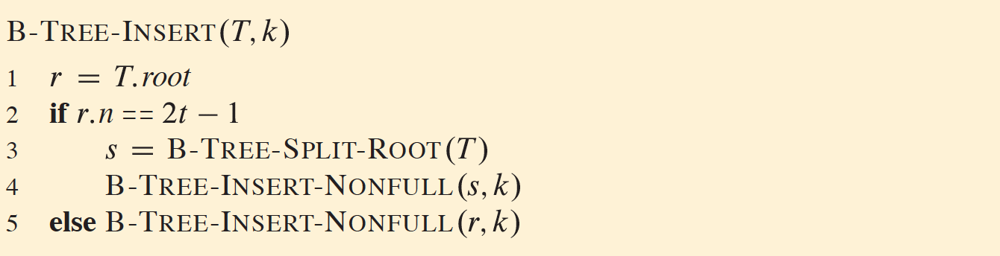
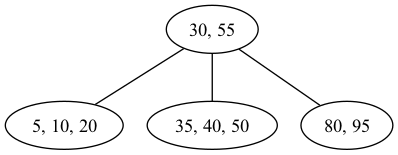
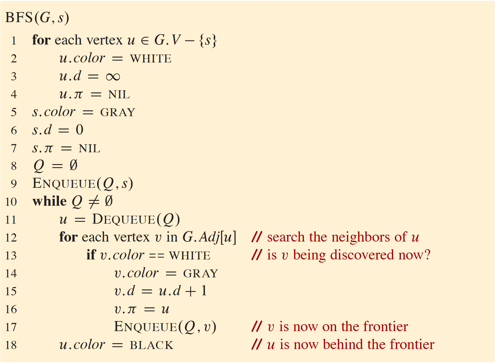
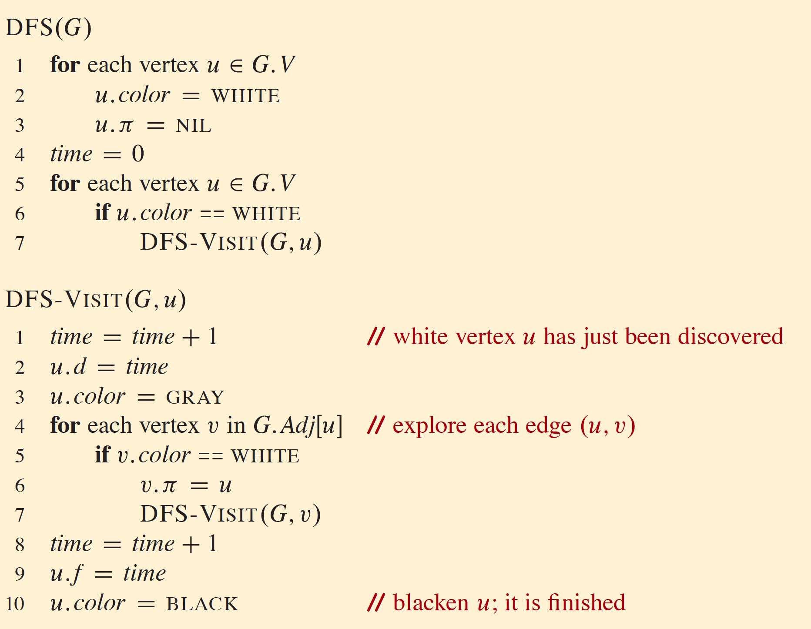
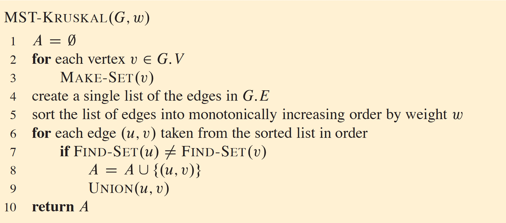
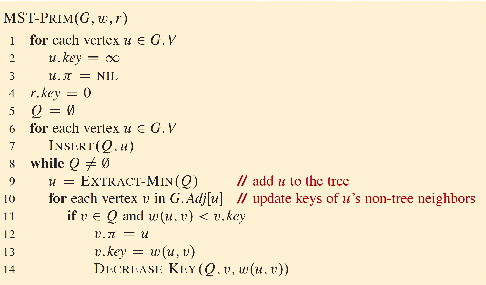

# ECS 36C Final Review

Jeremy Wang

---

# Final Review

## Topics

- Trees
- Sorting Algorithms
- Graphs

---

# Trees

- Binary Trees
- Binary Search Trees
- Red-Black Trees
- Heaps
- B-Trees

---

## Binary Trees

- Representation

---

## Binary Trees

- Representation
  - Nodes and references
  - Array (for complete binary trees)

---

## Binary Trees

- Representation
  - Nodes and references
  - Array (for complete binary trees)
- Traversal

---

## Binary Trees

- Representation
  - Nodes and references
  - Array (for complete binary trees)
- Traversal
  - Pre-order
  - In-order
  - Post-order

---

## Binary Search Trees

What are the properties of a Binary Search Tree?

---

### Properties of Binary Search Trees

What are the properties of a Binary Search Tree?

- Left subtree contains only nodes with keys less than the node's key
- Right subtree contains only nodes with keys greater than the node's key
- Left and right subtree must also be binary search trees

---

## Red Black Trees

- Why Red Black Tree?

- What are the properties of a Red Black Tree?

---

### Properties of Red Black Trees

1. Each node is either red or black
2. Root is black
3. Each Leaf is black
4. Each red node has only black children
5. For each node, all simple paths from the node to descendent leaves contain
   the same number of black nodes.

---

### Time Complexity

- Search
- Insertion
- Deletion

---

### Time Complexity

- Search: $O(\log n)$
- Insertion: $O(\log n)$
- Deletion: $O(\log n)$

---

## Heaps

- Why Heap?
- What are the properties of a Heap?

---

### Properties of Heaps

- Complete Binary Tree
- Min Heap: parent is smaller than children
- Max Heap: parent is larger than children

---

### Operations

- Sift up
- Sift down

---

### Time Complexity

- Insertion
- Pop
- Heapify an array
- Search

---

### Time Complexity

- Insertion: $O(\log n)$
- Pop: $O(\log n)$
- Heapify an array: $O(n)$
- Search: $O(n)$

---

## B-Trees

- Why B-Tree?
- What are the properties of a B-Tree?

---

## B-Trees

- Why B-Tree?

B-Trees are balanced search trees designed for systems that read and write large blocks of data.

---

### Properties of B-Trees

If a B-tree has a _minimum degree_ $t$:

- Keys and children are sorted.
- All leaves appear in the same level.
- Each node has at most $2t - 1$ keys.
- Each node has at least $t - 1$ keys.
- If there is $n$ keys in the node, there is $n+1$ children.

---

### B-Tree Insertion



---

### B-Tree Example

suppose $t = 2$,



---

### Time Complexity

- Search
- Insertion
- Deletion

---

### Time Complexity

- Search: $O(\log n)$
- Insertion: $O(\log n)$
- Deletion: $O(\log n)$

---

# Sorting

- Merge Sort
- Quick Sort
- [Insertion Sort](https://www.geeksforgeeks.org/insertion-sort-algorithm/)
- [Selection Sort](https://www.geeksforgeeks.org/selection-sort-algorithm-2/)

---

### Comparison

|                   | Quick Sort | Merge Sort | Insertion Sort | Selection Sort |
| ----------------- | ---------- | ---------- | -------------- | -------------- |
| Time Complexity   |            |            |                |                |
| Space Requirement |            |            |                |                |
| Stability         |            |            |                |                |

---

### Comparison

|                  | Quick Sort      | Merge Sort    | Insertion Sort | Selection Sort |
| ---------------- | --------------- | ------------- | -------------- | -------------- |
| Time Complexity  | $O(n \log n)$\* | $O(n \log n)$ | $O(n^2)$       | $O(n^2)$       |
| Space Complexity | $O(\log n)$     | $O(n)$        | $O(1)$         | $O(1)$         |
| Stability        | Unstable        | Stable        | Stable         | Unstable       |

\*average case, worst case $O(n^2)$

---

# Graphs

- BFS \& DFS
- Minimum Spanning Tree

---

## Definitions

Let $G = (V, E)$ denote a graph, where $V$ is the set of vertices and $E$ is the
set of edges.

**Defn** $G$ is _sparse_ if $|E| << |V|^2$.

_dense_?

---

## Definitions

Let $G = (V, E)$ denote a graph, where $V$ is the set of vertices and $E$ is the
set of edges.

**Defn** $G$ is _sparse_ if $|E| << |V|^2$.

**Defn** $G$ is _dense_ if $|E| \approx |V|^2$.

**Defn** $G$ is connected if for all $v \in V$, there is $(v, \_) \in E$. There
is a path from any vertex to any other vertex.

---

## Representation of Graph

adjacency list

```hs
type Neighbor = [Node]
map<Node, Neighbor>
```

adjacency matrix $A$

<!-- ```hs
type E = Edges
A i j =
  | (i, j) in E = 1
  | otherwise   = 0
``` -->

$$
a_{ij} = \begin{cases}
  1 \quad \text{if } (i, j) \in E \\
  0 \quad \text{otherwise}
\end{cases}
$$

---

### Pros & Cons?

Comparing Adj List and Adj Matrix


---

# Adjacency List Representation

### Graph Adjacency List
- **Node 0** → [(1, 3), (3, 7), (4, 8)]
- **Node 1** → [(0, 3), (2, 1), (3, 4)]
- **Node 2** → [(1, 1), (3, 2)]
- **Node 3** → [(0, 7), (1, 4), (2, 2), (4, 3)]
- **Node 4** → [(0, 8), (3, 3)]

---

### Explanation
- Each node points to a list of tuples `(neighbor, weight)`.
- Example:  
  For Node 0:  
  - It connects to Node 1 with weight 3.
  - It connects to Node 3 with weight 7.
  - It connects to Node 4 with weight 8.

---

# Adjacency Matrix Representation

### Graph Adjacency Matrix
|   | 0 | 1 | 2 | 3 | 4 |
|---|---|---|---|---|---|
| 0 | 0 | 3 | 0 | 7 | 8 |
| 1 | 3 | 0 | 1 | 4 | 0 |
| 2 | 0 | 1 | 0 | 2 | 0 |
| 3 | 7 | 4 | 2 | 0 | 3 |
| 4 | 8 | 0 | 0 | 3 | 0 |

---

# Explanation of Adjacency Matrix

### Key Features
- Each cell `(i, j)` in the matrix represents the weight of the edge between Node `i` and Node `j`.
- A value of `0` indicates no direct edge exists between the nodes.

### Example
- `(0, 1)` = 3 → Edge exists between Node 0 and Node 1 with weight 3.
- `(3, 4)` = 3 → Edge exists between Node 3 and Node 4 with weight 3.
- `(2, 4)` = 0 → No edge exists between Node 2 and Node 4.

---


### Pros & Cons?

what are some advantages/disadvantages of using a adj list?

- +: easier weights on edges
- -: $hasEdge: G \rightarrow Bool$ time complexity

what are some advantages/disadvantages of using a adj matrix?

- +: if undirected, $A$ must be symmetric
- +: faster computation (matrix algebra easier parallelized)
- +: $O(1)$ for $hasEdge$
- -: needs more memory

---

## Breadth-first search



---

## Depth-first search



---

### Pros & Cons?

Comparing BFS and DFS

---

### Pros & Cons?

Comparing BFS and DFS:

BFS: shortest path

DFS: topological sort

---

# Minimum Spanning Tree

Let graph $G = (V, E)$ be weighted. That is, for all $e \in E$, there is
$w_e \in \mathbb{R}$.

We want to find a subset $T \subseteq E$ such that,

$$
\min \quad \sum_{e \in T} w_e
$$

subject to

1. each $v \in V$ is connected to at least some edge $(\_, v)$ or
   $(v, \_) \in T$.
2. $T$ is connected and acyclic, $|T| = |V| - 1$.

---

## Kruskal



---

## Example Graph


---

### Steps
1. Sort edges by weight:
   - (1, 2): 1
   - (2, 3): 2
   - (0, 1): 3
   - (3, 4): 3
   - (1, 3): 4
   - (0, 3): 7
   - (0, 4): 8

---

2. Initialize a disjoint set.

3. Iterate through sorted edges:
   - Add (1, 2): No cycle.
   - Add (2, 3): No cycle.
   - Add (0, 1): No cycle.
   - Add (3, 4): No cycle.
   - Stop when |V| - 1 edges added.

### Resulting MST
Edges: {(1, 2), (2, 3), (0, 1), (3, 4)}  
Total Weight: 9

---

## Prim



---

## Example Graph


---

### Steps
1. Start from any node (e.g., Node 0).

2. Initialize priority queue with edges from Node 0:
   - (0, 1): 3
   - (0, 3): 7
   - (0, 4): 8

3. Add minimum edge:
   - Add (0, 1): Cost 3.
   - Add edges from Node 1:
     - (1, 2): 1
     - (1, 3): 4

---

4. Add (1, 2): Cost 1.
   - Add edges from Node 2:
     - (2, 3): 2

5. Add (2, 3): Cost 2.
   - Add (3, 4): Cost 3.

### Resulting MST
Edges: {(0, 1), (1, 2), (2, 3), (3, 4)}  
Total Weight: 9

---

Thank you! Good luck to all of you!